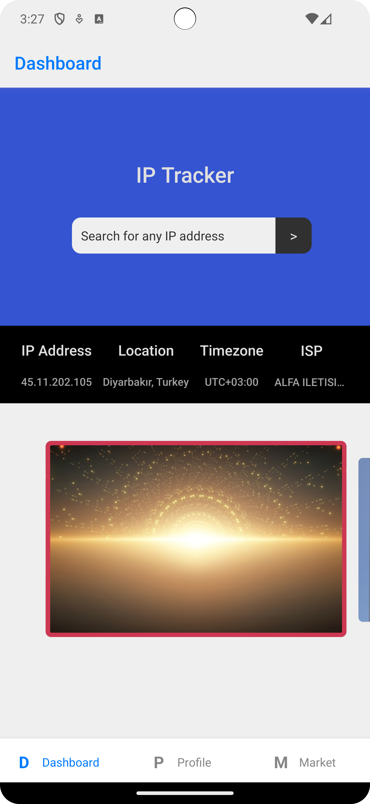
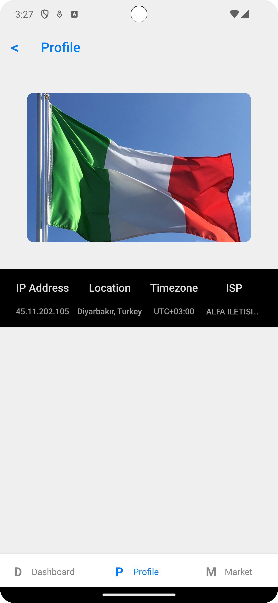
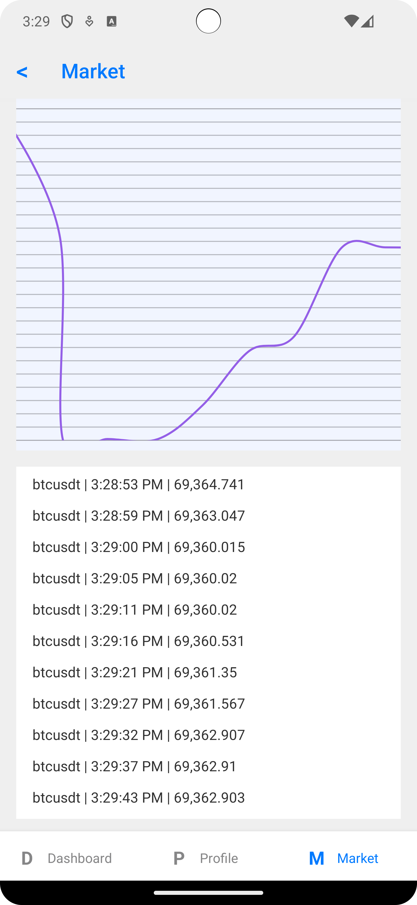

# Who am IP




</br>

### Installation
Install all packages run;
```bash
$ npm install
```
Install pods for iOS;
```bash
$ cd ios
$ pod install
```

### Run

Run metro bundler;
```bash
$ npm start
```

Run Android simulator;
```bash
$ npm run android
```

Run  Tests;
```bash
$ npm run test
```
